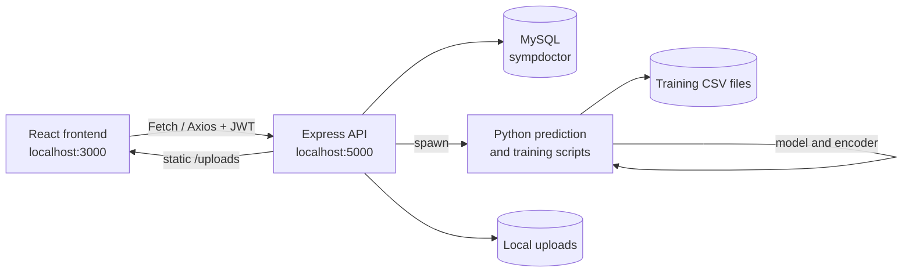

# SympDoctor

SympDoctor is a React and Express application for symptom-based disease prediction and moderated disease-data management. Clients select symptoms and receive a prediction from a Python/scikit-learn model. Doctors can propose and review diseases, while administrators manage users, doctor applications, and public feedback.

> This documentation describes the current source code. The project is configured for local development and does not currently include a database schema, environment-variable template, deployment configuration, or complete automated test suite.

## Contents

- [Overview](#overview)
- [Features](#features)
- [Application workflow](#application-workflow)
- [Architecture](#architecture)
- [Technology stack](#technology-stack)
- [Project structure](#project-structure)
- [Roles and permissions](#roles-and-permissions)
- [Data model](#data-model)
- [API reference](#api-reference)
- [Machine-learning workflow](#machine-learning-workflow)
- [Installation](#installation)
- [Configuration](#configuration)
- [Running the project](#running-the-project)
- [Testing](#testing)
- [Security considerations](#security-considerations)
- [Known limitations](#known-limitations)
- [Development](#development)
- [Contributing](#contributing)
- [License and author](#license-and-author)

## Overview

The application has two connected parts:

- A public React homepage for registration, login, password recovery, popular-disease information, and accepted feedback.
- An authenticated dashboard for diagnosis, profile management, role-specific disease review, doctor applications, feedback, user administration, and charts.

The backend stores users, diagnosis history, pending disease proposals, review logs, doctor applications, and feedback in MySQL. Disease names and symptoms are also maintained in CSV files used by the Python prediction and retraining scripts.

## Features

### Client features

- Register with personal details, country, birthdate, gender, email, username, password, and a security question.
- Log in with an email address or username.
- Select symptoms and request a predicted disease.
- Store diagnosis history with the user, date, and country.
- View diagnosis charts and filter the displayed data by date controls in the dashboard.
- Edit profile information, password, security question, and social links.
- Upload a PNG, JPG, or JPEG profile photo.
- Submit a PDF application to become a doctor and view application status.
- Submit feedback with a star rating and view submitted feedback.

Registration and profile editing validate required fields and enforce an age of at least 18. Profile editing also validates Facebook and LinkedIn URL prefixes and checks the current password.

### Doctor features

- View handled diseases and their symptoms.
- View pending disease proposals and their symptoms.
- Review a proposal once and record an acceptance or rejection reason.
- Add a disease name and symptom combination to the pending dataset.
- View disease and diagnosis statistics.

### SuperDoctor features

- Perform the final approval or rejection of pending disease proposals.
- On approval, move the proposal into the training dataset and trigger model retraining.

### Administration features

- View users and user profiles.
- Toggle a user's banned state.
- Change roles subject to the current administrator's role.
- Review submitted doctor applications, download their PDF files, and accept or reject them.
- Accept or reject user feedback, including a rejection reason.
- View global diagnosis data and disease-count charts.

The homepage displays a shuffled selection of up to five accepted feedback entries and popular diseases calculated from recorded client diagnoses.

## Application workflow

1. A visitor opens the React homepage and can register or log in.
2. Registration creates a row in MySQL after required-field, password-match, email-match, and age checks.
3. Login checks the submitted email or username and plaintext password, rejects banned users, and returns a one-hour JWT.
4. The frontend stores the JWT in `localStorage` and uses its decoded user ID to load dashboard data.
5. A client loads the available symptoms, submits selected symptoms, and receives a Python decision-tree prediction.
6. The predicted disease is stored in the diagnosis history with the user's country and timestamp.
7. A client may apply to become a doctor by uploading a PDF. An administrator reviews the application and, on acceptance, changes the applicant's role to `Doctor`.
8. A Doctor submits a new disease proposal. It is written to pending CSV data and recorded in MySQL.
9. Doctors review the proposal. A SuperDoctor can give final approval, which updates the main CSV data and retrains the model, or reject it with a reason.
10. Administrators moderate feedback and manage users. Accepted feedback can appear on the public homepage.

## Architecture



The React application uses React Router for public and dashboard routes. The Express server mounts three routers under `/api/users`, `/api/diseases`, and `/api/feedback`. Controllers call MySQL model classes and launch Python subprocesses where dataset inspection, prediction, or retraining is required.

Authentication uses JWTs signed by the backend. The server also creates an Express session on login, but most frontend route checks and controller authorization use the JWT instead.

## Technology stack

| Technology | Purpose |
| --- | --- |
| React 18 | Frontend UI |
| Create React App / `react-scripts` 5 | Frontend development and production build |
| React Router DOM 6 | Client-side routing and role-gated dashboard routes |
| Node.js and Express 4 | HTTP API server |
| MySQL and `mysql2` | Relational persistence |
| JWT and `jwt-decode` | Login tokens and frontend token checks |
| `express-session` | Server session middleware configured at login |
| `cors` and `body-parser` | Cross-origin requests and JSON parsing |
| Multer | Profile-photo and PDF upload handling |
| Python, pandas, scikit-learn, joblib | Dataset processing, decision-tree prediction, and model persistence |
| Axios and Fetch | Frontend HTTP requests |
| Bootstrap and styled-components | UI styling and layout |
| Recharts | Dashboard charts |
| React Leaflet and React Simple Maps | Map and geographic visualizations |
| `d3-geo` | Geographic calculations used by frontend visualizations |

## Project structure

```text
.
|-- backend/
|   |-- Controllers/       # User, admin, disease, and system controllers
|   |-- models/            # MySQL access classes
|   |-- python/            # Prediction, training, and CSV utilities
|   |-- routes/            # Express route definitions
|   |-- uploads/           # Uploaded application files and profile photos
|   |-- db.js              # MySQL connection pool
|   |-- server.js          # Express server and route mounting
|   `-- package.json       # Backend dependencies
|-- public/                # CRA public assets and manifest
|-- src/
|   |-- dashboard/         # Authenticated dashboards and role-specific views
|   |-- homepage/          # Public home, login, registration, and reset pages
|   |-- App.js             # Router and frontend access gates
|   `-- index.js           # React entry point
|-- package.json           # Frontend dependencies and scripts
`-- README.md
```

The repository also contains a duplicate dashboard tree under `src/dashboard/dashboard`. The active router in `src/App.js` imports from `src/dashboard`, so the duplicate tree is not the primary runtime path.

## Roles and permissions

| Role | Implemented permissions |
| --- | --- |
| `Client` | Manage own profile, receive predictions, view own diagnosis history, submit doctor applications, and submit feedback |
| `Doctor` | Client capabilities plus propose diseases, review pending diseases, and view doctor statistics |
| `SuperDoctor` | Doctor capabilities plus final approval or rejection of pending diseases and model retraining |
| `Admin` | User administration, feedback moderation, doctor-application review, application downloads, and global statistics. Cannot change or ban a `SuperAdmin`. |
| `SuperAdmin` | Admin capabilities with broader role-management and user-management permissions |

Frontend route gating is based on the decoded token and `UserContext`. Several backend endpoints independently check JWTs and roles, while other endpoints rely on a client-supplied user ID; see [Security considerations](#security-considerations).

## Data model

The model classes reference these MySQL tables:

| Table | Purpose | Important relationships |
| --- | --- | --- |
| `users` | Identity, profile, role, password, security data, ban state, login data, and activity counters | Referenced by diagnoses, proposals, review logs, applications, and feedback |
| `disease` | Client diagnosis history | `userid` identifies the client; stores disease, date, and country |
| `pendingdiseases` | Doctor-proposed diseases and moderation state | `poster` identifies the proposing user; stores status, action data, counters, and reason |
| `pendingdiseaseslogs` | Doctor review decisions and comments | `doctor` and `diseaseId` identify the reviewer and proposal |
| `doctor_applicartions` | Uploaded doctor applications | `applicant` identifies the applying user; stores filename, status, and reason |
| `feedback` | User feedback and moderation data | `poster` identifies the author; stores stars, status, handler, date, and reason |

No SQL schema, migration, seed script, column-type documentation, or verified foreign-key definitions are included in the repository. The table names and relationships above are inferred from the SQL queries in `backend/models`.

## API reference

The API is served by the backend at `http://localhost:5000`. Request bodies are JSON unless a route accepts a multipart upload. Protected operations expect `Authorization: Bearer <jwt>`.

### User routes: `/api/users`

| Method | Endpoint | Description |
| --- | --- | --- |
| `POST` | `/register` | Validate and create a user |
| `POST` | `/login` | Authenticate by email or username and return a one-hour JWT |
| `GET` | `/getuserbyid/:id` | Get a user by path ID |
| `GET` | `/getuserbyid?id=...` | Get a user by query-string ID |
| `POST` | `/getuserbyemail` | Find a user by email |
| `POST` | `/profile/edit` | Update profile and optional password/security fields |
| `POST` | `/changepassword` | Change a password from the reset flow |
| `POST` | `/verifysecurityquestion` | Check reset security-question data |
| `POST` | `/uploadprofilephoto` | Upload a PNG, JPG, or JPEG profile photo |
| `POST` | `/applytobeadoctor` | Upload a PDF doctor application |
| `POST` | `/getapplications` | List applications for an administrator or applicant |
| `GET` | `/getapplicationbyid/:id` | Get one application for an administrator |
| `POST` | `/downloadapplication` | Download an application file for an administrator |
| `POST` | `/acceptapplication/:id` | Accept an application and promote the applicant to Doctor |
| `POST` | `/declineapplication/:id` | Reject an application with a reason |
| `POST` | `/getallusers` | List users |
| `POST` | `/updaterole/:id` | Change a user's role |
| `POST` | `/ban/:id` | Toggle a user's banned state |

### Disease routes: `/api/diseases`

| Method | Endpoint | Description |
| --- | --- | --- |
| `GET` | `/getsymptoms` | Return the available symptoms from the dataset |
| `POST` | `/finddiseases` | Predict a disease from selected symptoms and record the diagnosis |
| `POST` | `/getalldiseases` | Return diseases from the handled dataset |
| `POST` | `/getpendingdiseases` | Return diseases from the pending dataset |
| `POST` | `/getpendingdiseasesdb` | Find a pending disease by name |
| `POST` | `/getpendingdiseasebyid` | Find a pending disease by ID |
| `POST` | `/getidofpendingdiseasebyname` | Get a pending disease ID by name |
| `POST` | `/getsymtompsbydiseasenameh` | Get symptoms for a handled disease |
| `POST` | `/getsymtompsbydiseasenamep` | Get symptoms for a pending disease |
| `POST` | `/finddiseasebyname` | Check the handled dataset for a disease name |
| `POST` | `/finddiseasebynameaddingdisease` | Check handled and pending datasets for a disease name |
| `POST` | `/adddisease` | Add a Doctor proposal and update pending training data |
| `POST` | `/getalldiseasesdb` | List recorded diagnoses |
| `POST` | `/getdiseasesbyuser` | List diagnoses for one user |
| `POST` | `/getdiseasesofclients` | Aggregate diagnoses by disease |
| `POST` | `/verifydiseasehandler` | Check whether a Doctor has reviewed a proposal |
| `POST` | `/getreasonsbyid` | Get review reasons for a proposal |
| `POST` | `/approve` | Record a Doctor-level approval |
| `POST` | `/disapprovebydoctor/:id` | Record a Doctor-level rejection |
| `POST` | `/superdoctoraccept` | Finalize a proposal and retrain the model |
| `POST` | `/disapprovebysuperdoctor/:id` | Finalize a rejection |

### Feedback routes: `/api/feedback`

| Method | Endpoint | Description |
| --- | --- | --- |
| `POST` | `/post` | Create feedback for the authenticated user |
| `POST` | `/getfeedbacks` | List feedback for an administrator or current user |
| `POST` | `/getfeedbacksforhomepage` | Return up to five accepted homepage entries |
| `GET` | `/getfeedbackbyid/:id` | Get one feedback record for an administrator |
| `POST` | `/acceptfeedback/:id` | Accept feedback |
| `POST` | `/declinefeedback/:id` | Reject feedback with a reason |

The feedback router currently registers `/acceptfeedback/:id` twice; both registrations point to the same controller.

## Machine-learning workflow

The prediction flow is implemented across `backend/Controllers/diseaseController.js` and `backend/python`:

1. `GET /api/diseases/getsymptoms` reads the symptom columns from `Training.csv`.
2. The frontend sends selected symptoms and the user ID to `POST /api/diseases/finddiseases`.
3. Node.js builds a binary symptom object and starts `predict.py`.
4. `predict.py` loads `Training.csv`, `decision_tree_model.pkl`, and `disease_encoder.pkl`.
5. A scikit-learn `DecisionTreeClassifier` predicts the encoded disease and decodes its name.
6. Node.js stores the result in the `disease` table.

`train_my_code.py` fills missing values, encodes the final disease column, uses an 80/20 train-test split, trains a `DecisionTreeClassifier(random_state=42)`, prints accuracy, and writes the model and encoder with joblib.

Disease proposals use `Training1.csv` and `Training2.csv` through the CSV utility scripts. Final SuperDoctor approval runs `approve_pending_disease.py` and then retrains the model.

## Installation

### Prerequisites

- Node.js and npm.
- MySQL Server on port `3306`.
- A MySQL database named `sympdoctor`.
- Python with `pandas`, `scikit-learn`, and `joblib`.
- A Python executable available as `python` on `PATH`.
- Writable `backend/uploads/applications` and `backend/uploads/profilephoto` directories.

The repository does not include a `requirements.txt` or SQL schema, so Python package installation and database-table creation must be performed separately.

### Install dependencies

From the repository root:

```bash
npm install
cd backend
npm install
cd ..
```

### Prepare the database

Create a MySQL database named `sympdoctor`, then create the tables expected by the model classes. The project does not include the required `CREATE TABLE` statements, so the exact schema must be supplied separately or recovered from the existing development database.

### Prepare Python

Install the packages used by the scripts:

```bash
python -m pip install pandas scikit-learn joblib
```

The prediction scripts expect these generated files in `backend/python`:

- `Training.csv`
- `decision_tree_model.pkl`
- `disease_encoder.pkl`

The model and encoder can be regenerated with the training script, subject to its relative-path requirements:

```bash
cd backend
python python/train_my_code.py
```

## Configuration

The current source does not read database credentials, JWT secrets, session secrets, API URLs, or Python paths from environment variables. Local defaults are hard-coded in the backend:

| Setting | Current value |
| --- | --- |
| API port | `5000`, or `process.env.PORT` if provided |
| MySQL host | `localhost` |
| MySQL port | `3306` |
| MySQL user | `root` |
| MySQL database | `sympdoctor` |
| MySQL password | `hello` in `server.js` and `db.js` |
| Frontend API base URL | `http://localhost:5000` |

Before sharing or deploying the application, move these values to environment variables and rotate the committed credentials and secrets. Do not copy production secrets into this README.

## Running the project

Start the backend in one terminal:

```bash
cd backend
node server.js
```

Start the React frontend from the repository root in another terminal:

```bash
npm start
```

The expected local URLs are:

- Frontend: `http://localhost:3000`
- Backend: `http://localhost:5000`
- Uploaded files: `http://localhost:5000/uploads/...`

The backend package does not define a `start` script. The frontend has these declared scripts:

```bash
npm start
npm test
npm run build
npm run eject
```

No production server, hosting provider, reverse proxy, or deployment configuration is included in the repository.

## Testing

The frontend contains the default CRA test entry at `src/App.test.js`, but it still expects a Create React App "learn react" link and does not match the current application. Run it with:

```bash
npm test
```

The backend test script is a placeholder that exits with an error. There are no repository tests for API routes, controllers, MySQL integration, uploads, authorization, predictions, or model training.

## Security considerations

The following behavior is present in the current implementation and should be addressed before production use:

- Passwords and security-question answers are stored and compared in plaintext.
- JWT secrets, the Express session secret, and MySQL credentials are committed in source code.
- The password-reset flow verifies a security question and then changes the password without a separate reset token.
- CORS is enabled globally without an origin allowlist.
- Frontend route guards are client-side checks and cannot provide backend authorization.
- Some endpoints use IDs supplied by the client and do not consistently verify ownership or role.
- Upload validation checks filename extensions but does not enforce a visible size limit or inspect file contents.
- `/uploads` is served as a public static directory, although application download routes perform an administrator check.

Use HTTPS, hashed passwords, strong environment-managed secrets, server-side authorization on every protected operation, strict CORS, upload size/content validation, and a tokenized password-reset flow before deploying.

## Known limitations

- No database schema, migration, or seed data is included.
- Python scripts use relative paths and different interpreter conventions (`python`, `python3`, and a hard-coded Python 3.9 path in some adapters), so execution depends on the local environment and working directory.
- Prediction and disease-list output is passed between Node.js and Python using string splitting rather than a consistent structured format.
- Some controller operations start asynchronous writes or Python tasks without awaiting every operation before responding.
- Disease approval changes CSV data, retrains the model, and updates MySQL without a transaction or rollback path.
- CSV files are used as mutable application data, which is unsafe for concurrent requests or multiple backend instances.
- The frontend API and upload URLs are fixed to `localhost:5000`.
- The backend manifest does not declare `axios`, although some backend controllers require it.
- The repository contains duplicate dashboard and Python-related implementations, making maintenance and ownership less clear.
- The disease approval controller references `currentDisease` before declaring it in the Doctor approval and rejection authorization conditions; those paths may fail before authorization is evaluated.
- No project screenshots, video demo link, license file, or deployment configuration is included.

## Development

When making changes, start the backend and frontend independently, then exercise the affected role workflow in the browser. Keep frontend API calls consistent with the route prefixes in `backend/server.js` and update both the controller and model when changing MySQL behavior.

| Change | Main locations |
| --- | --- |
| Public pages and authentication forms | `src/homepage` |
| Dashboard routes and role gates | `src/App.js`, `src/dashboard` |
| API endpoints | `backend/routes` |
| Request handling and authorization | `backend/Controllers` |
| MySQL queries | `backend/models`, `backend/db.js` |
| Prediction and retraining | `backend/python`, `backend/Controllers/diseaseController.js` |
| Uploaded-file handling | `backend/routes/users.js`, `backend/uploads` |

After frontend changes, run `npm run build`. For backend changes, at minimum start `node server.js` and exercise the affected endpoint against a configured MySQL database. Automated backend validation is not currently provided.

## Contributing

1. Fork the repository.
2. Create a focused branch:

   ```bash
   git checkout -b feature/your-change
   ```

3. Install dependencies and configure a local MySQL/Python environment.
4. Make the change and test the affected frontend workflow or API route.
5. Build the frontend with `npm run build`.
6. Commit and push your branch:

   ```bash
   git add .
   git commit -m "Describe the change"
   git push origin feature/your-change
   ```

7. Open a pull request with setup notes and test results.

## License and author

The repository does not contain a license file. The backend package declares `ISC`, but no project-level license document is present, so licensing should be clarified by the project owner before public redistribution.

No verified author profile or contact information is included in the project metadata. The backend package has an empty `author` field.

## Acknowledgements

The project uses open-source packages from the React, Express, MySQL, scikit-learn, Bootstrap, Recharts, React Leaflet, and related ecosystems. Their individual licenses are provided by the installed packages and should be reviewed before distribution.
